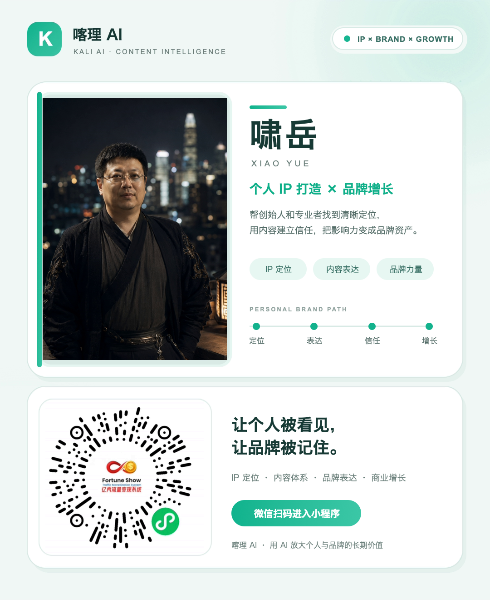

# Kali Publish

Kali Publish 是本地运行的多平台视频发布后端，通过本机 Chrome 保存各平台登录态，支持视频上传和网页自动发布。定时发布只在已适配平台开放。

让个人被看见，让品牌被记住。欢迎[体验喀理系统](#体验喀理系统)，或访问 [www.kaliai.fun](https://www.kaliai.fun/)，了解完整的 AI 内容创作能力。

## 支持平台

| Type | 平台 | 账号方式 | 立即发布 | 定时发布 |
|---:|---|---|:---:|:---:|
| 1 | 小红书 | 浏览器登录 | 是 | 是 |
| 2 | 视频号 | 浏览器登录 | 是 | 是 |
| 3 | 抖音 | 浏览器登录 | 是 | 是 |
| 4 | 快手 | 浏览器登录 | 是 | 是 |
| 5 | TikTok | 浏览器登录 | 是 | 是 |
| 6 | YouTube | 浏览器登录 | 是 | 否 |
| 7 | X | 浏览器登录 | 是 | 否 |
| 8 | Instagram | 浏览器登录 | 是 | 否 |
| 9 | Facebook | 浏览器登录 | 是 | 否 |
| 10 | 支付宝生活号 | 浏览器登录 | 是 | 是 |
| 11 | 拼多多（个人账号，实验性） | 浏览器登录 | 已接入，待实测 | 已接入，待实测 |

所有平台都通过 `/login` 添加账号，不再需要开发者 API 令牌。TikTok、YouTube、X、Instagram 和 Facebook 的首次登录使用完全普通的 Chrome 窗口和各自独立的资料目录，因此通过 Google 账号登录时不会进入“浏览器不安全”的重试页。登录完成时会将会话导出到本地独立文件，后续发布只复用导出会话，不再直接打开登录用的 Chrome 资料库。Facebook 会发布到登录窗口中当前选中的身份；如果要发到主页，登录时先切换到对应主页身份。

视频号发布会按现有业务规则追加 `#喀理系统` 和 `@岳同学AI`，并在新版发布页可用时选择第二个内容标记项。

## 下载与启动

从 [GitHub Releases](https://github.com/pabatiba89-sys/kali-publish/releases/latest) 下载对应版本。可执行版不需要安装 Python，但运行前必须安装 Google Chrome。

### Apple Silicon

下载并解压 `kali-publish-*-macos-arm64.zip`，在终端进入解压目录后运行：

```bash
./kali-publish
```

如果 macOS 阻止首次运行，先校验下载页提供的 SHA-256 文件，再运行：

```bash
xattr -dr com.apple.quarantine kali-publish
./kali-publish
```

### Windows x64

下载并解压 `kali-publish-*-windows-x64.zip`，然后双击 `kali-publish.exe`，或在命令提示符中运行：

```bat
kali-publish.exe
```

启动后访问 <http://127.0.0.1:5409/health> 检查服务状态，按 `Ctrl+C` 停止服务。

## 从源代码启动

需要 Python 3.10 或更高版本，以及 Google Chrome。

macOS / Linux：

```bash
chmod +x install.sh start.sh
./install.sh
./start.sh
```

Windows：

```bat
install.bat
start.bat
```

## 使用流程

1. 启动 Kali Publish。
2. 通过登录接口打开 Chrome，完成平台登录并添加账号。
3. 上传待发布视频。
4. 调用单次发布或批量发布接口，选择平台、账号和发布时间。

## 体验喀理系统

让个人被看见，让品牌被记住。

喀理系统面向个人创作者、内容团队和企业，把 AI 用在日常内容生产中：找选题、写文案、制作数字人内容、探索 AI 短剧，再把完成的视频发布到不同平台。

你可以在喀理系统中使用：

- 数字人：用于口播与内容表达，减少反复出镜录制的负担。
- 声音克隆：在本人或获得授权的前提下，让内容使用熟悉的声音。
- 热点追踪：关注热点变化，为下一条内容寻找选题。
- 文案智能体：辅助整理思路、撰写文案，把想法变成可用的内容。
- AI 短剧：探索 AI 辅助的短剧创作，让故事有更多表达方式。
- 多平台发布：减少逐个平台上传、填写和提交的重复操作。

喀理系统支持团队和企业使用，注重实用性与性价比，让 AI 工具更容易融入持续的内容生产。

当前开源仓库 Kali Publish 专注于多平台视频发布。数字人、声音克隆、热点追踪、文案智能体和 AI 短剧等属于喀理系统完整产品的能力，不包含在本仓库中。

访问 [www.kaliai.fun](https://www.kaliai.fun/)，或用微信扫描下方小程序码，体验喀理系统。具体功能与套餐以产品页面为准。

<p align="center">
  <a href="docs/assets/kaliai-xiaoyue-card.png">
    
  </a>
</p>

图片较小时，可点击查看原图后扫码。

## API

- `GET /health`：检查服务状态
- `GET /api/platforms`：获取支持的平台
- `POST /upload`：上传视频
- `POST /uploadFromUrl`：从公网 HTTP/HTTPS 地址下载视频到本机，支持跨域预检
- `GET /getFiles`：获取已上传视频
- `DELETE /deleteFile`：删除视频
- `GET /login`：打开浏览器登录任一支持平台
- `GET /getAccounts`：获取发布账号
- `GET /getValidAccounts`：获取账号并仅实时验证视频号 Cookie，其他平台保留已存状态
- `DELETE /deleteAccount`：删除发布账号
- `POST /api/publish`：单次发布
- `POST /api/publish/batch`：批量发布

### 登录账号

例如添加 X 账号：

```text
GET /login?type=7&id=brand-x
```

返回 `browser_opened` 后，在弹出的 Chrome 窗口中登录，并保持窗口打开直到服务返回 `200`，此时账号才已保存。其他平台只需替换 `type`。TikTok、YouTube、X、Instagram 和 Facebook 会通过专用 Chrome 资料中必需的 Cookie 名称确认登录完成，不依赖可能被锁定或误判的浏览历史，也不读取 Cookie 内容。登录态保存在数据目录的 `cookiesFile/`，不会读取日常 Chrome 资料；删除账号时会一并删除对应登录态。

X、Instagram、Facebook 和 TikTok 可传 `description` 或 `content`；YouTube 还可传 `description`、`thumbnailPath`、`playlist`、`visibility`；TikTok 可传 `thumbnailPath`；支付宝生活号可传 `description`、`thumbnailPath`、`collectionName`。封面文件需要先通过 `/upload` 上传，并传入返回的 `filepath`。

TikTok 立即发布时，若出现“继续发布？”且提示“版权检查未完成、停止检查”的弹窗，会按用户选择自动点击一次“立即发布”。这会停止尚未完成的检查；系统仍等待跳转到平台内容列表才报告完成，超时不会重复提交。其他警告不自动确认，定时任务也不会因此改成立即发布。

对不支持原生定时的平台，即使请求携带 `sendnow=schedule`，后端也会自动改为立即发布，不再返回“不支持定时”错误。

支付宝生活号支持平台原生定时发布：传入 `sendnow: "schedule"` 和 `endpublishTime`，格式为 `YYYY-MM-DD HH:mm`（北京时间），也接受带时区的 ISO 时间并转换为北京时间。时间精确到整分钟，提交时必须仍在未来 **15 分钟至 14 天**内；请预留扫码登录和视频上传的时间。系统会展开更多设置、选中“定时发布”、填写日期并确认日历，在最终提交前再次核对选项及时间。时间无效或页面设置失败会停止，**不会改成立即发布**。接口成功表示定时任务已提交，不表示视频已公开；实际发布状态以支付宝后台为准。

支付宝账号登录失效时，会弹出登录页等待扫码；登录成功后继续原发布任务，成功提交后更新该账号的 Cookie 并关闭本次发布窗口。

### 拼多多个人账号（首版试运行）

直接使用 [多多视频个人创作者入口](https://live.pinduoduo.com/n-creator/video/home)，不经过商家后台。通过 `GET /login?type=11&id=my-pdd` 添加账号，在弹出的浏览器完成个人登录。登录识别、封面默认行为和最终发布结果尚未经过真实账号验证；当前版本采用个人会话 Cookie 加页面控件的保守检查，页面不符时会停止而非假报登录成功。未改变“仅视频号实时验证 Cookie”的账号列表规则。

请求示例（仅适用于确实含 AI 生成内容的视频；文件名替换成 `/upload` 和账号接口返回的值）：

```json
{
  "type": 11,
  "title": "视频标题",
  "description": "视频描述",
  "tags": ["话题"],
  "fileList": ["uploaded-video.mp4"],
  "accountList": ["pdd-personal-account.json"],
  "contentDeclaration": "含AI生成内容",
  "sendnow": "now",
  "dryRun": true
}
```

- `dryRun` 默认 `true`：**会把视频上传到平台并填写表单，但不会点击最终发布按钮**；这不是完全离线模拟，平台可能自动保存草稿。成功返回 `status: "prepared"` 和 `published: false`。本仓库的自动化测试只用本地模拟页面，不向拼多多上传文件。
- 真正提交须明确传 JSON 布尔值 `dryRun: false`。系统只点击一次发布，并等待新的可见成功提示；页面跳转、表单消失和超时均不算成功。若提示结果未确认，先查看平台内容列表，避免重复发布。定时提交返回 `status: "scheduled"`，不代表视频已公开。
- `contentDeclaration` 必填，可选：`内容无需标注`、`含AI生成内容`、`含虚构演绎内容`、`内容含营销信息`、`内容为转载`、`个人观点，仅供参考`。必须按真实内容选择，不自动推断或统一选择“无需标注”。
- 定时请求传 `sendnow: "schedule"`、`endpublishTime: "YYYY-MM-DD HH:mm:ss"`。无时区的时间按北京时间处理，带时区的 ISO 时间会保留对应时刻。需晚于当前时间，具体可选范围以平台页面为准；会选择日期和时分秒、点击“确认”、核对完整时间，失败不改成立即发布。首版不强制要求商品 ID。
- 暂不自动挂商品、绑定任务或上传自定义封面，使用平台默认封面；传入这些未支持参数会报错，不会忽略后继续发布。上传和结果等待均为 15 分钟；登录失效时等待个人重新登录，成功后继续并更新 Cookie，结束后关闭本次窗口。
- `/api/platforms` 会展示第 11 个平台及 `experimental`、`defaultDryRun` 和 `contentDeclarations`。本仓库仅包含后端；独立前端若写死平台列表，仍需将第 11 项及内容声明选择接入。

页面控件参考了 [multi-platform-auto-upload 的拼多多模块](https://github.com/cjccd/multi-platform-auto-upload/tree/4c8b6465c2473aac3cfe064c8c6dfbadd87b2238/uploader/pdd_uploader) 和用户提供的个人账号截图；没有采用其商家登录路径、强制挂商品规则或宽松成功判定。

## 数据与配置

- macOS 数据目录：`~/Library/Application Support/Kali Publish/`
- Windows 数据目录：`%LOCALAPPDATA%\Kali Publish\`
- `KALI_PUBLISH_DATA_DIR`：自定义数据目录
- `LOCAL_CHROME_PATH`：指定 Google Chrome 路径
- `LOCAL_CHROME_HEADLESS`：控制浏览器是否无界面运行
- `HOST`、`PORT`：修改监听地址和端口

服务默认只监听 `127.0.0.1:5409`，不应直接暴露到公网，因为它没有用户认证且可接收发布凭据。发布包未进行商业代码签名，首次运行可能出现系统安全提示。
